<div align="center">

# FoundrBase

**Where real problems meet the people who solve them.**

A community platform where people post problems worth solving, pitch ideas and improvements, and find collaborators. It includes real-time chat, group conversations and an AI writing assistant.

[**Live demo →**](https://foundrbase-web.onrender.com)


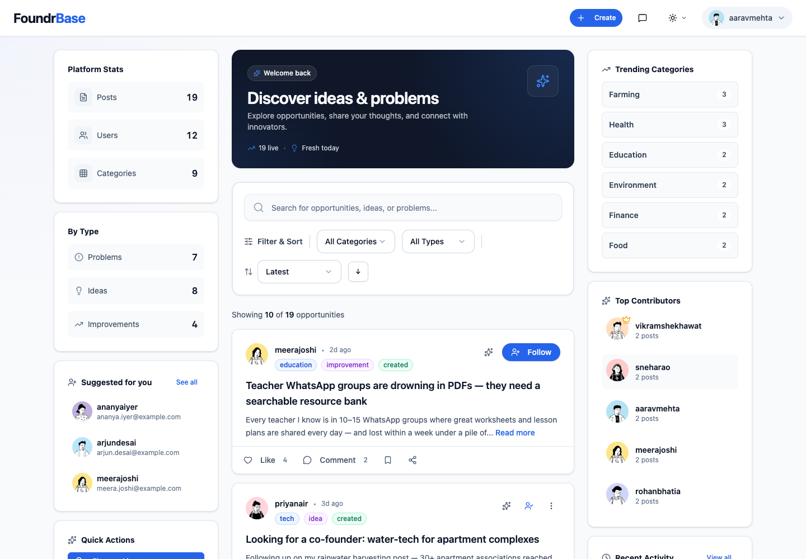

</div>

> **Note:** the demo runs on free hosting. If nobody has visited for a while, the first page load can take up to a minute while the server wakes up.

---

## ✨ Features

### Share what matters
- **Three post types:** *problems*, *ideas* and *improvements*, across categories like farming, health, education, tech, finance and government.
- **Photos and videos** on posts, uploaded to Cloudinary.
- **Search, filter and sort** by category, type, newest, most liked or most discussed.
- **Drafts:** save a post and come back to it later.

### Engage with the community
- **Likes, comments and bookmarks.** Comments can include images and GIFs.
- **Follow people** and get suggestions for who to follow.
- **Profiles** with a bio, location, avatar and stats (posts, followers, following, likes).
- **Platform stats:** trending categories, top contributors and recent activity.

### Real-time messaging
- **Direct messages over WebSockets**, with typing indicators, online status and "last seen".
- **Message requests:** strangers can't flood your inbox; you accept or decline first.
- **Group chats** with admins, member management and group pictures.
- **Message tools:** emoji reactions, pinned messages, photos, GIFs (GIPHY), plus muting and blocking.

### AI writing assistant (Google Gemini)
- **Writing help:** suggest titles, improve a description, or get structured feedback on an idea.
- **Chat with the assistant** while you write, with your current draft as context.
- **One-click summaries** of a post and its whole comment thread.
- **Guardrails:** content checks keep the assistant focused on writing posts.

### Personalisation and privacy
- **Four themes:** light, dark, slate and forest.
- **Privacy controls:** who can follow or message you, hide online status, notification preferences.
- **Account settings:** change your username, email or password.
- **Responsive design** that works on phones as well as desktops.

---

## 📸 Screenshots

<table>
  <tr>
    <td width="50%">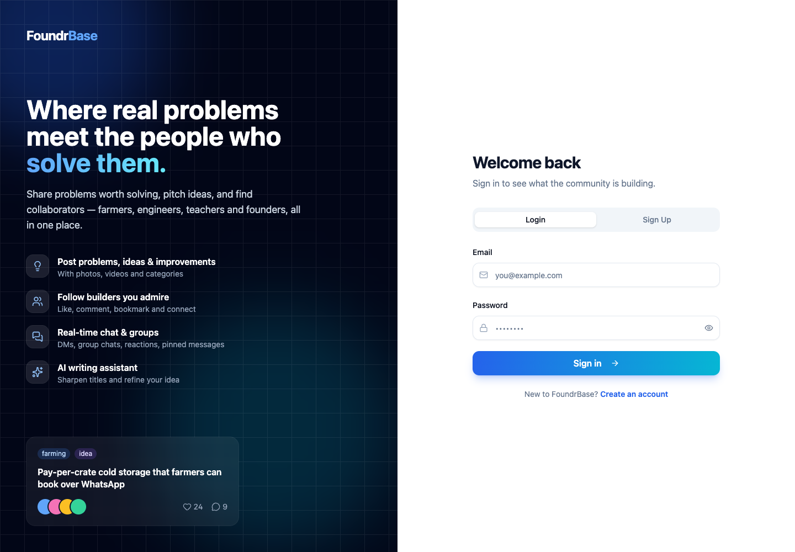<br><sub><b>Sign in</b>: email and password authentication with JWT</sub></td>
    <td width="50%">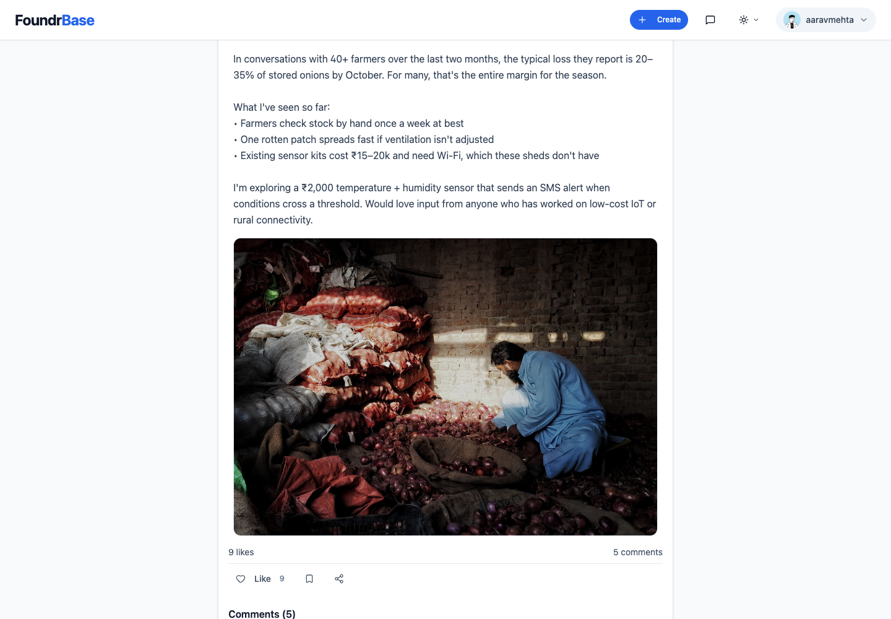<br><sub><b>Posts</b>: rich descriptions, photos and discussion threads</sub></td>
  </tr>
  <tr>
    <td>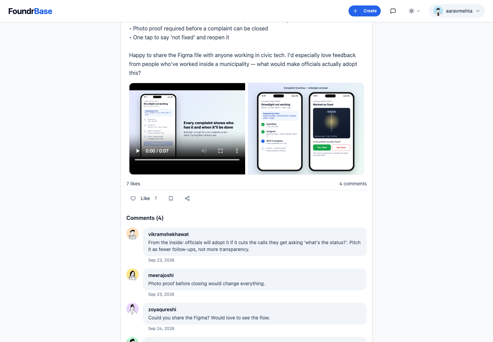<br><sub><b>Media</b>: videos and images side by side</sub></td>
    <td>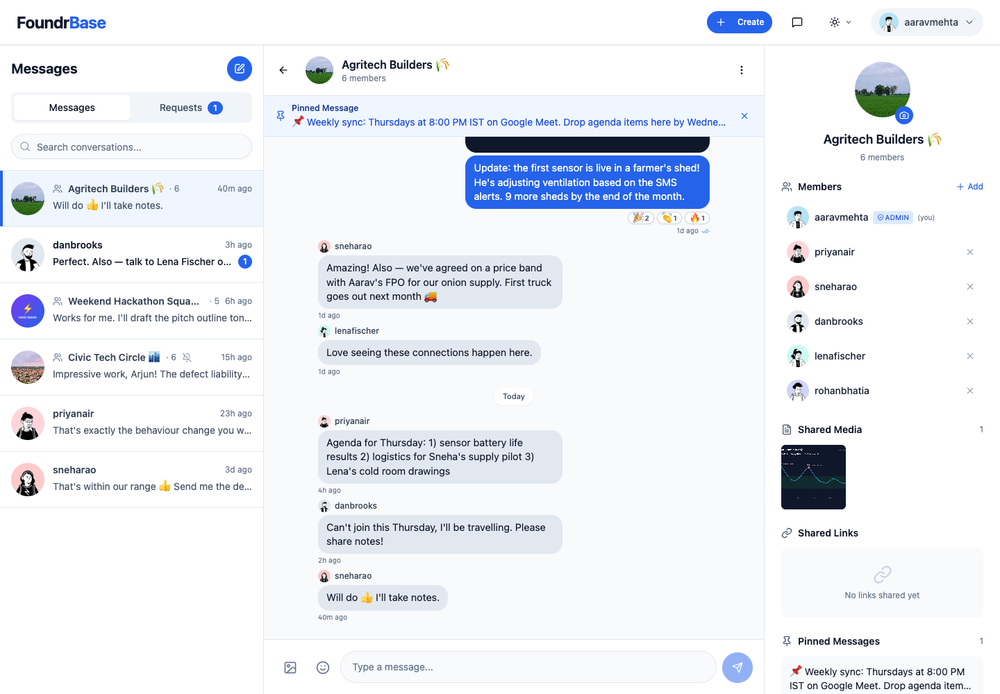<br><sub><b>Group chats</b>: pinned messages, reactions, member list</sub></td>
  </tr>
  <tr>
    <td>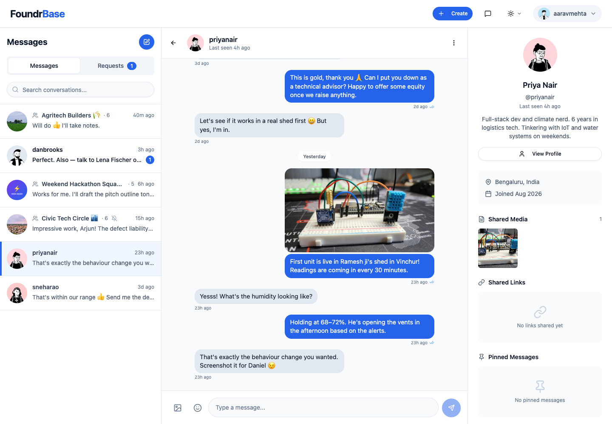<br><sub><b>Direct messages</b>: real time, with photos and read receipts</sub></td>
    <td>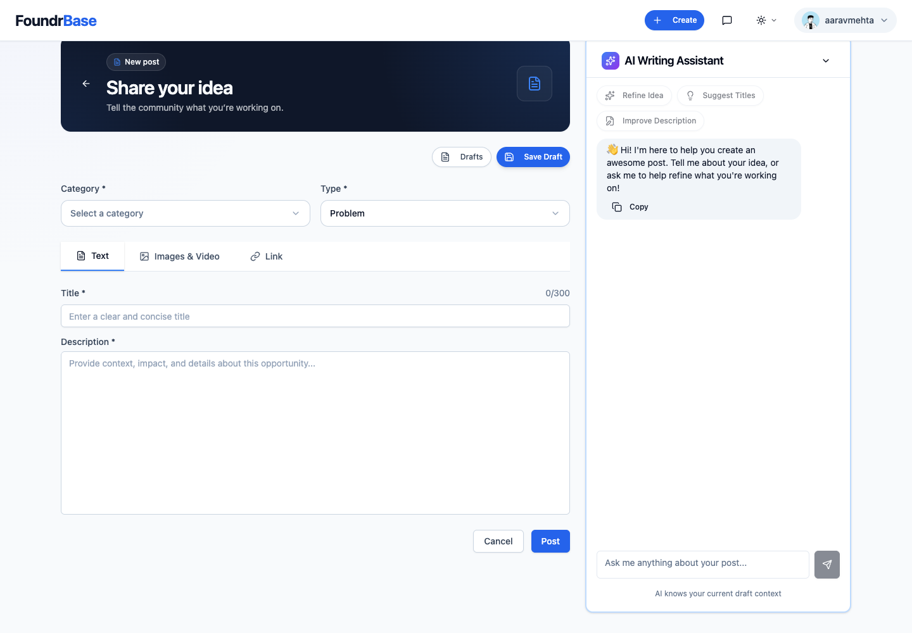<br><sub><b>AI writing assistant</b>: titles, feedback and chat while you write</sub></td>
  </tr>
  <tr>
    <td>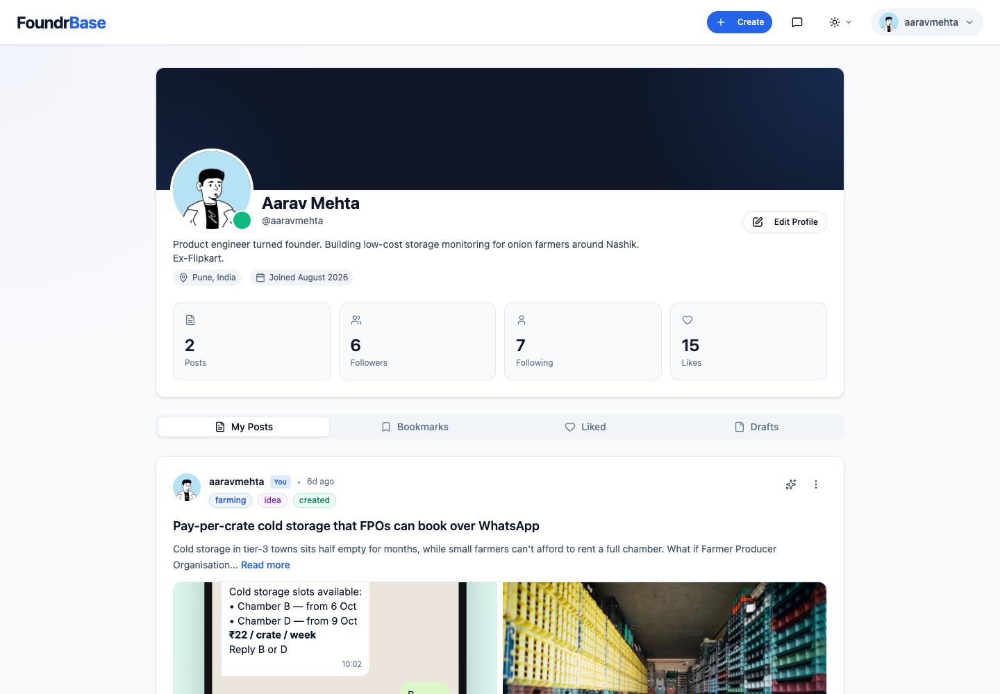<br><sub><b>Profiles</b>: stats, posts, bookmarks, likes and drafts</sub></td>
    <td>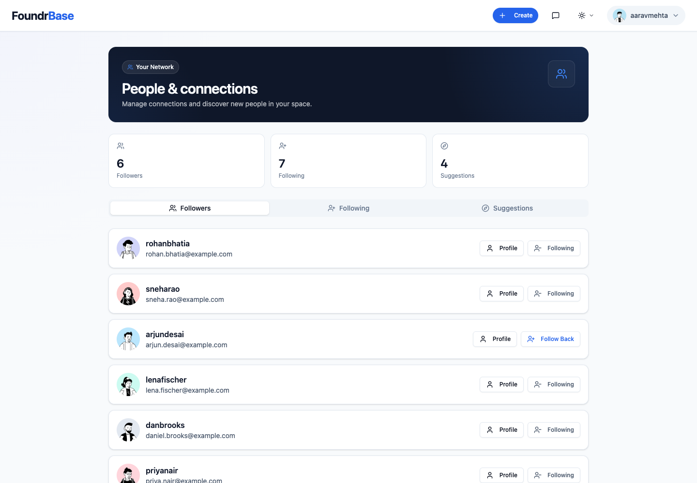<br><sub><b>Network</b>: followers, following and suggestions</sub></td>
  </tr>
  <tr>
    <td>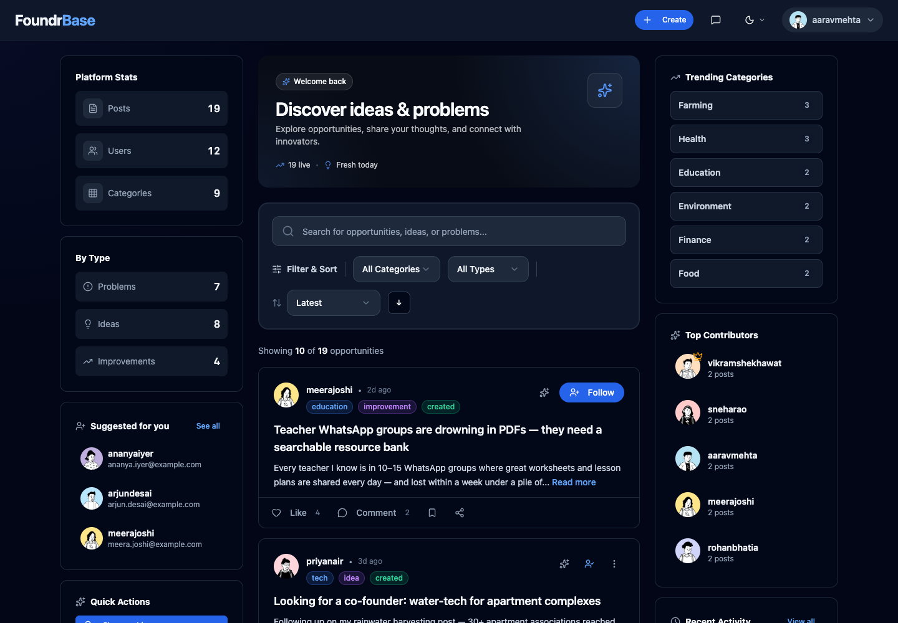<br><sub><b>Dark mode</b>: plus slate and forest themes</sub></td>
    <td align="center">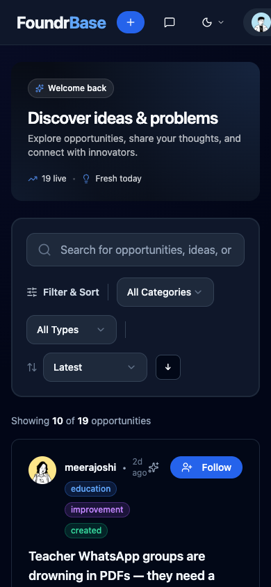<br><sub><b>Mobile</b>: responsive on small screens</sub></td>
  </tr>
</table>

---

## 🏗️ Architecture

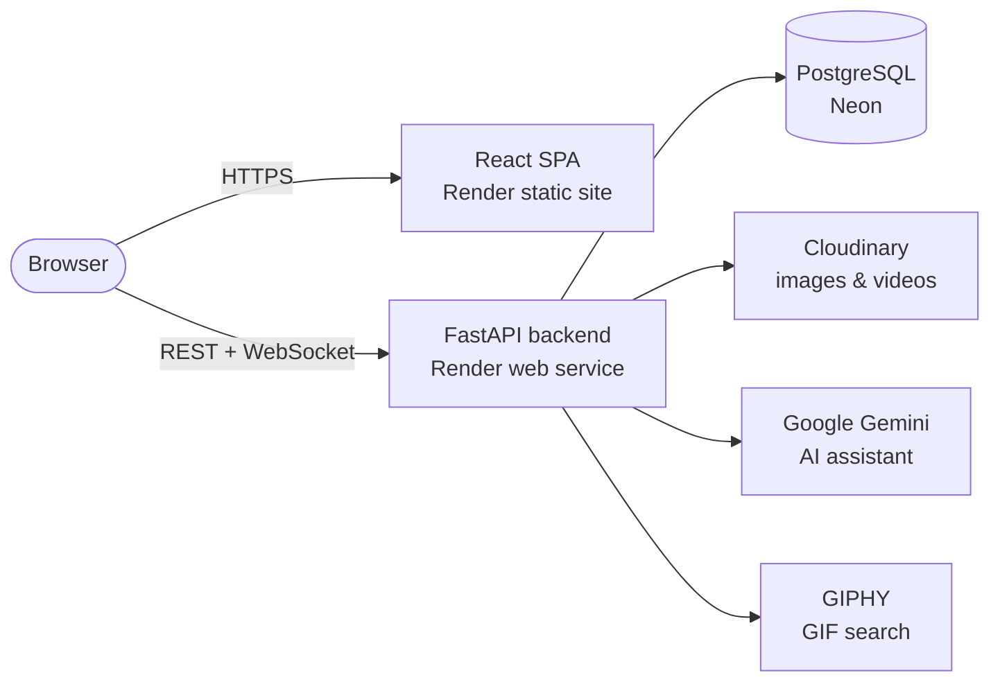

| Layer | Tech |
| --- | --- |
| Frontend | React 19, TypeScript, Vite, Tailwind CSS, shadcn/ui (Radix), TanStack Query, Zustand, React Router |
| Backend | FastAPI, SQLAlchemy 2, Pydantic v2, JWT auth (python-jose + bcrypt), native WebSockets |
| Database | PostgreSQL (Neon) in production, SQLite for local development |
| Integrations | Cloudinary (media), Google Gemini (AI), GIPHY (GIFs) |
| Hosting | Render: static site for the frontend, web service for the API |

The backend is organised **by feature** (`auth`, `opportunities`, `comments`, `likes`, `bookmarks`, `follows`, `messages`, `media`, `ai`, `settings`, `stats`, `drafts`). Each feature has its own router, service, schemas and models, which makes the codebase easy to extend.

```
FoundrBase/
├── backend/
│   └── app/
│       ├── core/          # settings, security (JWT, hashing)
│       ├── db/            # engine, session, model registry
│       └── features/      # one folder per feature: router / service / schemas / models
├── frontend/
│   └── src/
│       ├── components/    # pages, chat UI, media, shadcn/ui primitives
│       ├── services/      # typed API clients
│       ├── hooks/         # WebSocket, follow, comments, engagement
│       └── store/         # auth & theme state (Zustand)
├── render.yaml            # one-click Render Blueprint
└── DEPLOYMENT.md          # free deployment guide
```

---

## 🚀 Run it locally

**Prerequisites:** Python 3.13 and Node.js 22 or newer.

**Backend** (http://127.0.0.1:8000, with API docs at `/docs`)
```bash
cd backend
python -m venv venv && source venv/bin/activate
pip install -r requirements.txt
cp .env.example .env            # add API keys if you want AI, uploads and GIFs
uvicorn app.main:app --reload
```

**Frontend** (http://localhost:5173)
```bash
cd frontend
npm install
npm run dev
```

The app works without any API keys. Without Cloudinary, uploads are saved to local disk. Without GIPHY, a small built-in set of GIFs is used. Without Gemini, the AI assistant is turned off.

## ☁️ Deploy for free

The repo includes a [Render Blueprint](render.yaml). Connect the repo on Render, fill in a few environment variables, and both the frontend and the API deploy on the free tier. For data that survives restarts, point `DATABASE_URL` at a free [Neon](https://neon.com) Postgres database. The full walkthrough is in **[DEPLOYMENT.md](DEPLOYMENT.md)**.

---

<div align="center">

Built by **[Samay Singh](https://github.com/samay-singh-pro)**

</div>
